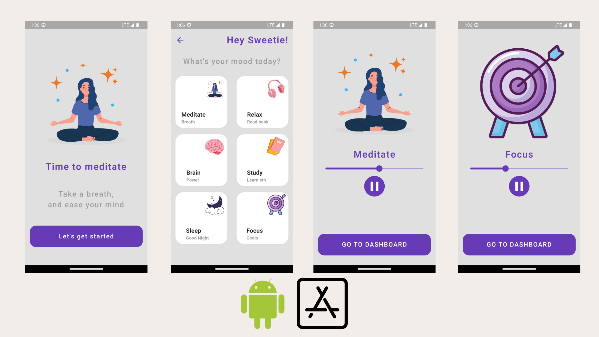

# Mediatation App

An app that make you calm, relief, relax, and focus 🧘

### Screens



### Features

- Play, resume, stop musics according to your choice
- English language
- Simple good looking UI

### Pakages

- audioplayer - for music player

### Author

[Phat Panhareach](https://github.com/Re4ch-Jay/)


### Usage

```bash
# Clone this repository
$ git clone https://github.com/Re4ch-Jay/Meditation_App.git

# Install dependencies
$ flutter packages get

# Run the app
$ flutter run
```
